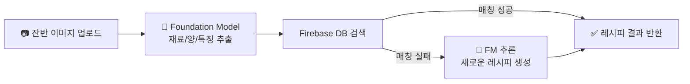

# 🍽️ School Meal Leftover Recipe Recommender

## 2025/09/22 ~ 2025/09/23 33조 뭐해먹지 프로젝트 발표

## 📌 프로젝트 개요
학교 급식에서 발생하는 대량 음식물 쓰레기를 효율적으로 활용하기 위해,
**멀티모달 Foundation Model**과 **Firebase DB**를 결합한 레시피 추천 시스템입니다.

> **핵심 아이디어**  
> 1. 급식소 잔반 사진을 업로드  
> 2. 멀티모달 Foundation Model을 사용하여 이미지에서 **재료/양/특징 추출**  
> 3. **Firebase DB**에서 우선적으로 매칭되는 레시피 검색  
> 4. 없으면 Foundation Model이 **추론을 통해 새로운 레시피 생성**  

---

## 🚨 문제 정의
- 한국은 매년 수백만 톤의 음식물 쓰레기를 발생시킴  
- 처리 비용만 수조 원 규모, 환경적 부담 심각  
- 기존 솔루션: **가정용 소량 재료 처리**에 집중  
- 공백: **학교 급식 등 대량 잔반 처리**에 특화된 서비스 부족

---

## 💡 해결 방안 (Architecture)

- **멀티모달 FM**: 텍스트+이미지 분석  
- **Firebase**: 빠른 검색, 데이터 신뢰성 확보  
- **Fallback**: 매칭 실패 시 자동 추론 → 확장성 보장

---

## 🛠️ 구현 기능
- [x] 이미지 → 재료 키워드/양(g) 분석  
- [x] Firebase DB 레시피 검색  
- [x] 검색 실패 시 FM 추론 기반 레시피 생성  
- [ ] 알러지/영양소 태깅 기능  
- [ ] 발주 최적화/탄소 절감 효과 리포트  

---

## 🎥 시연 (Demo)

[발표자료](/docs/hackathon.pdf)
[데모 동영상](/docs/video.mp4)

---

## 🔑 차별화 포인트
- 기존: 소량/가정용 레시피 추천  
- 본 프로젝트: **급식소 대량 잔반 최적화**  
- Firebase **우선 검색 → 신뢰성 확보**  
- FM 추론 → **g 단위 정량, 알러지 필터, 발주 예측** 지원

---

## 🚀 향후 계획
- 데이터셋 확대 + 모델 재학습  
- 알러지/영양 정보 자동 표시  
- 급식소 발주 예측 + 탄소 절감 효과 분석  
- 지자체·학교와 연계한 실제 운영 테스트

---

## 👥 팀 소개
- Backend 한동환, 최정재: Firebase, API, DB 설계  
- AI/ML 김용필 : Foundation Model 연동, 데이터 추론  
- Frontend 강지나: 이미지 업로드 & 레시피 결과 UI  
- PM 한동환 : 프로젝트 관리 및 아키텍처 설계
- 기획 이준용 : 프로젝트 기획 및 발표자료 정리
- CI/CD 김성현: github Actions & Self-hosted-runner 를 이용한 Docker Service 파이프라인구축
--
